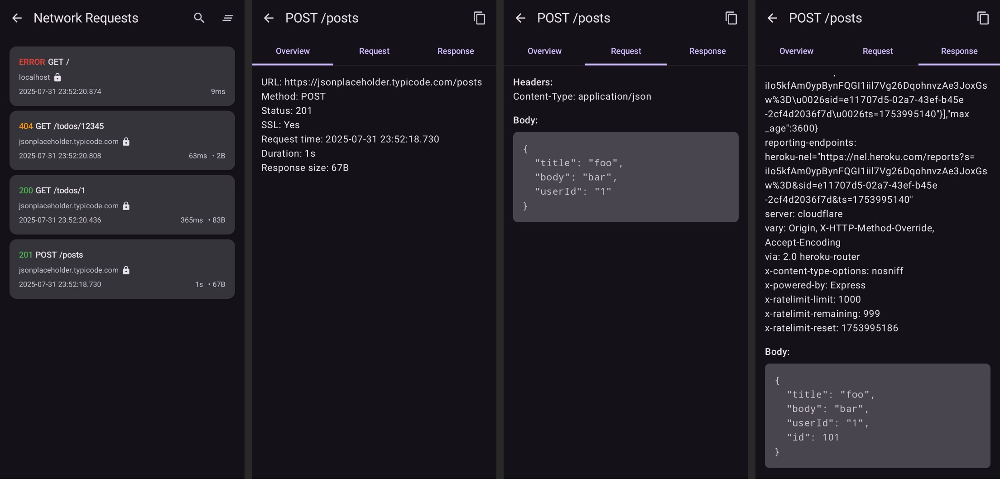
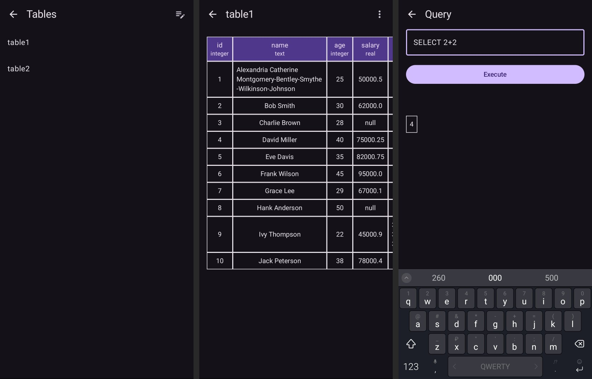
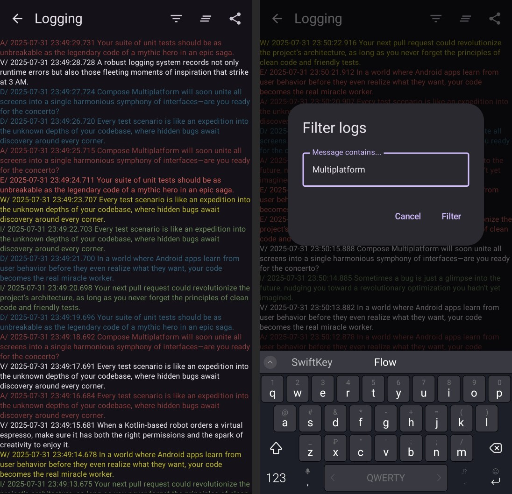
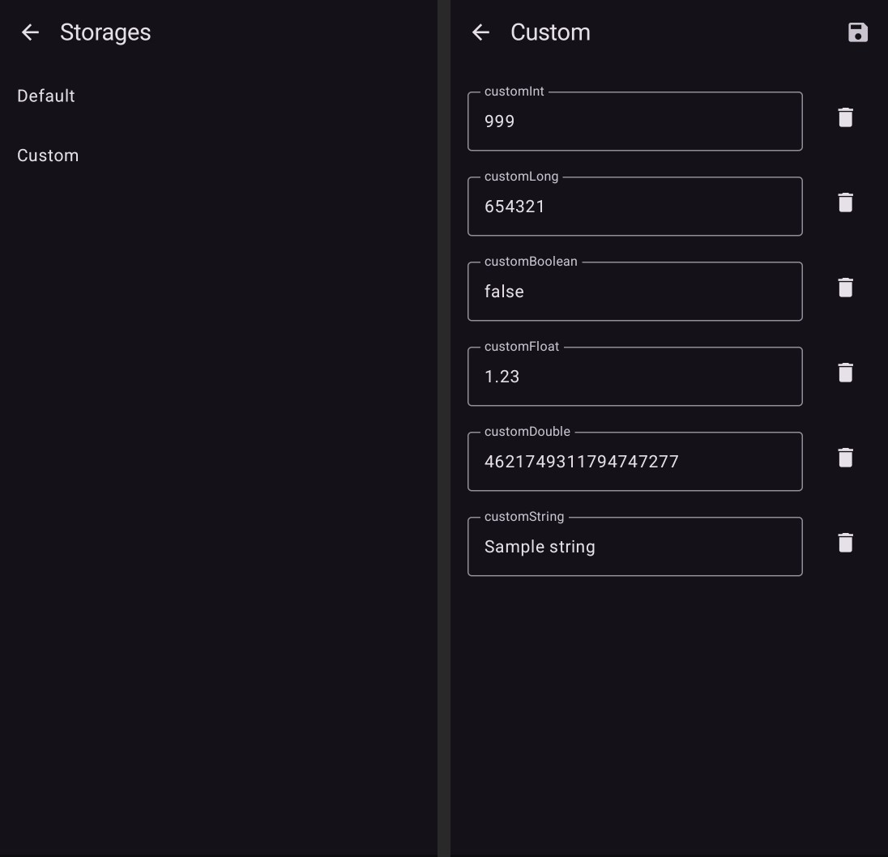
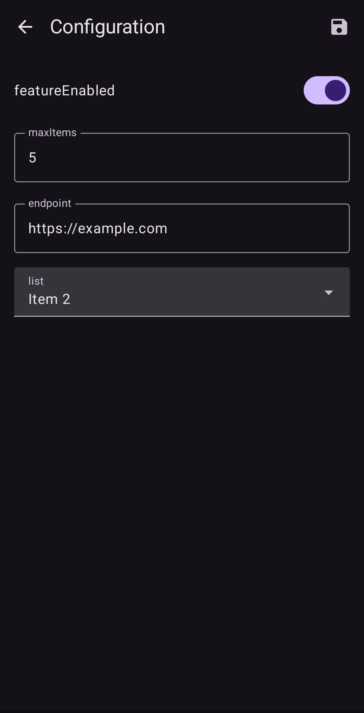
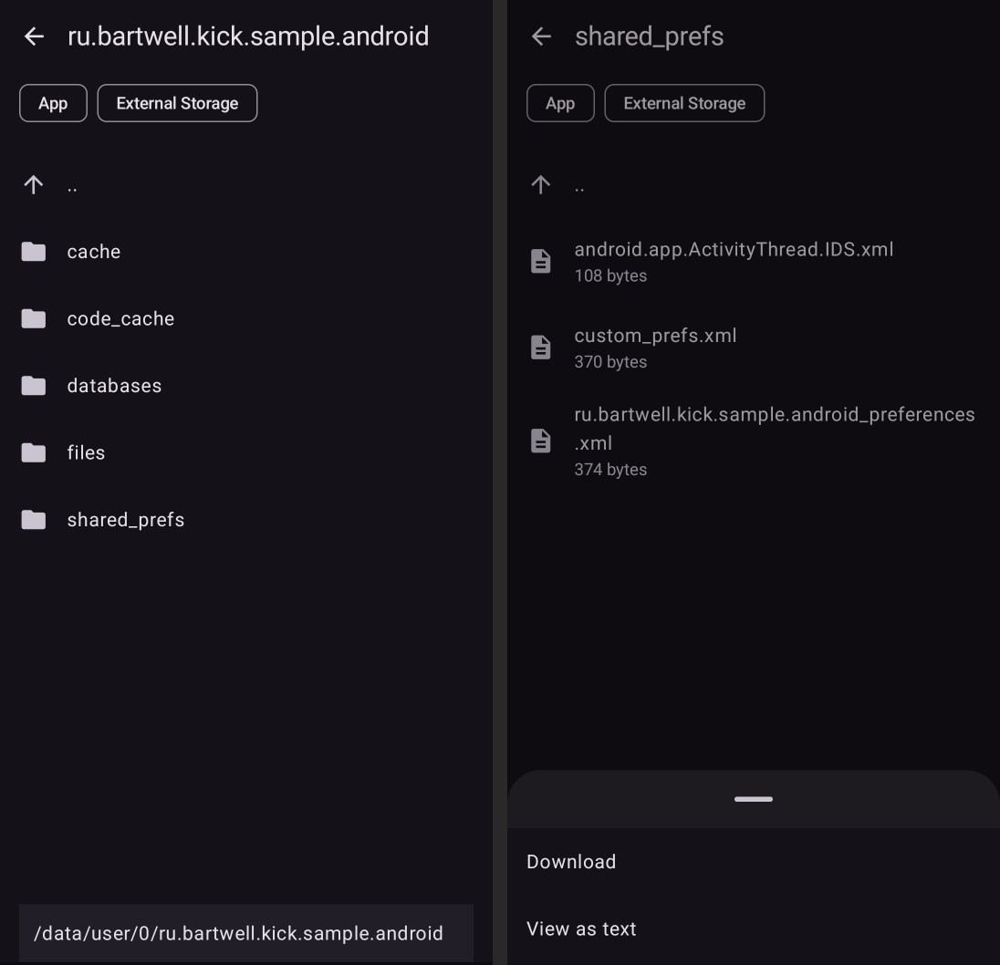
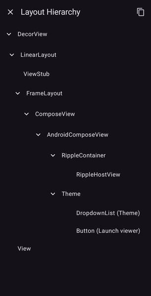
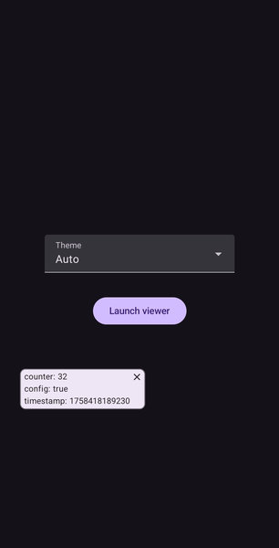

# Kick: Kotlin Inspection & Control Kit

Debugging doesn't have to be a headache.

Kick simplifies inspection and control across Android, iOS and desktop with a unified, modular toolkit built on Compose Multiplatform. Replace scattered utilities with a single customizable solution embedded right into your app—no more juggling separate tools, no more command-line headaches.

Effortlessly manage logs, network traffic, SQLite databases, file systems and multiplatform settings directly from within your application. Enable only what you need, easily extend functionality with custom modules and keep your app lean and efficient.

Less complexity, faster development, total visibility. That's Kick.

## Table of Contents

- [Features](#features)
- [Usage](#usage)
- [Modules](#modules)
    - [Ktor3](#ktor3)
    - [SQLite](#sqlite)
    - [Logging](#logging)
    - [Multiplatform Settings](#multiplatform-settings)
    - [Control Panel](#control-panel)
    - [File Explorer](#file-explorer)
    - [Layout](#layout)
    - [Overlay](#overlay)
- [Advanced Module Configuration](#advanced-module-configuration)
- [Shortcuts](#shortcuts)
- [Launching Kick](#launching-kick)
- [Contributing](#contributing)
- [License](#license)

## Features

- Cross-platform, unified toolkit — inspect and debug Android, iOS and desktop apps with one seamless solution built on Compose Multiplatform
- Fully modular — activate only what you need, or extend effortlessly with custom modules
- Embedded viewer — inspect logs, network traffic, SQLite databases, file systems and multiplatform settings directly from within your app
- Easy shortcuts — launch inspection tools quickly via shortcuts with a single click
- Simple integration — just initialize with `Kick.init`

## Usage

Kick is initialized once with a platform context and a list of modules. Add every module dependency in `shared/build.gradle.kts` and choose real or stub implementations using the `isRelease` flag:

```kotlin
val isRelease = /* your logic to determine release vs. debug */

kotlin {
    listOf(
        iosX64(),
        iosArm64(),
        iosSimulatorArm64()
    ).forEach {
        it.binaries.framework {
            baseName = "shared"
            isStatic = true
            export("ru.bartwell.kick:main-core:1.0.0")
            if (isRelease) {
                export("ru.bartwell.kick:main-runtime-stub:1.0.0")
            } else {
                export("ru.bartwell.kick:main-runtime:1.0.0")
            }
        }
    }

    sourceSets {
        commonMain.dependencies {
            implementation("ru.bartwell.kick:main-core:1.0.0")
            if (isRelease) {
                implementation("ru.bartwell.kick:main-runtime-stub:1.0.0")
                implementation("ru.bartwell.kick:ktor3-stub:1.0.0")
                implementation("ru.bartwell.kick:sqlite-runtime-stub:1.0.0")
                implementation("ru.bartwell.kick:sqlite-sqldelight-adapter-stub:1.0.0")
                implementation("ru.bartwell.kick:sqlite-room-adapter-stub:1.0.0")
                implementation("ru.bartwell.kick:logging-stub:1.0.0")
                implementation("ru.bartwell.kick:multiplatform-settings-stub:1.0.0")
                implementation("ru.bartwell.kick:file-explorer-stub:1.0.0")
                implementation("ru.bartwell.kick:layout-stub:1.0.0")
            } else {
                implementation("ru.bartwell.kick:main-runtime:1.0.0")
                implementation("ru.bartwell.kick:ktor3:1.0.0")
                implementation("ru.bartwell.kick:sqlite-core:1.0.0")
                implementation("ru.bartwell.kick:sqlite-runtime:1.0.0")
                implementation("ru.bartwell.kick:sqlite-sqldelight-adapter:1.0.0")
                implementation("ru.bartwell.kick:sqlite-room-adapter:1.0.0")
                implementation("ru.bartwell.kick:logging:1.0.0")
                implementation("ru.bartwell.kick:multiplatform-settings:1.0.0")
                implementation("ru.bartwell.kick:file-explorer:1.0.0")
                implementation("ru.bartwell.kick:layout:1.0.0")
            }
        }
    }
}
```

**Note:** stub modules provide no-op implementations instead of the full implementations so your release build stays lightweight.

Because many Android API calls require a Context, you need to wrap it using `PlatformContext`. Here is a sample of initialization:

```kotlin
// val context = androidContext.toPlatformContext() // For Android
// val context = getPlatformContext() // For iOS and desktop
// val context = platformContext() // In Compose
// let context: PlatformContext = PlatformContextKt.getPlatformContext() // For Swift
Kick.init(context) {
    module(SqliteModule(SqlDelightWrapper(sqlDelightDriver)))
    module(SqliteModule(RoomWrapper(roomDatabase)))
    module(LoggingModule(context))
    module(Ktor3Module(context))
    module(MultiplatformSettingsModule(listOf("MySettings1" to settings1, "MySettings2" to settings2)))
    module(FileExplorerModule())
    module(LayoutModule(context))
}
```

## Modules

### Ktor3

<a href="content/screenshots/ktor.jpg" target="_blank" rel="noopener noreferrer">
  
</a>

Monitor HTTP traffic performed with Ktor3. Just install the provided plugin:

```kotlin
val client = HttpClient(getEngineFactory()) {
    install(KickKtor3Plugin)
}
```

### SQLite

<a href="content/screenshots/sqlite.jpg" target="_blank" rel="noopener noreferrer">
  
</a>

View and edit SQLite databases. Use one of the provided adapters (or both if you are really using Room and SqlDelight in one application) for your favorite library.

```kotlin
// SqlDelight
module(SqliteModule(SqlDelightWrapper(sqlDelightDriver)))

// Room
module(SqliteModule(RoomWrapper(roomDatabase)))
```

### Logging

<a href="content/screenshots/logging.jpg" target="_blank" rel="noopener noreferrer">
  
</a>

Gather and review log messages right from the viewer. Add logs with a simple call:

```kotlin
Kick.log(LogLevel.INFO, "message")
```

You can also pipe existing [Napier](https://github.com/AAkira/Napier) logs into Kick so you only configure logging only once:

```kotlin
Napier.base(object : Antilog() {
    override fun performLog(priority: NapierLogLevel, tag: String?, throwable: Throwable?, message: String?) {
        val level = when (priority) {
            NapierLogLevel.VERBOSE -> LogLevel.VERBOSE
            NapierLogLevel.DEBUG -> LogLevel.DEBUG
            NapierLogLevel.INFO -> LogLevel.INFO
            NapierLogLevel.WARNING -> LogLevel.WARNING
            NapierLogLevel.ERROR -> LogLevel.ERROR
            NapierLogLevel.ASSERT -> LogLevel.ASSERT
        }
        Kick.log(level, message)
    }
})
```

### Multiplatform Settings

<a href="content/screenshots/settings.jpg" target="_blank" rel="noopener noreferrer">
  
</a>

Edit values stored with [Multiplatform Settings](https://github.com/russhwolf/multiplatform-settings). Register as many storages as you need and switch between them at runtime.
**Note:** Multiplatform Settings doesn’t expose metadata about field types, so Kick can only display and edit values as plain text. When type information becomes available, it will be possible to implement type‑specific views — for example, a switch for Boolean or a numeric input for Int, Long, Double, or Float.

### Control Panel

<a href="content/screenshots/configuration.jpg" target="_blank" rel="noopener noreferrer">
  
</a>

Create configuration options, such as an endpoint URL or debug flags, available during app runtime.
Provide a list of `ControlPanelItem` objects to `ControlPanelModule`. Each item is either an input (`InputType`) or an action (`ActionType`).
You can optionally group items by `category` to keep long lists organized. Categories are collapsible; items without a category are shown first and are always visible.
Inputs can optionally include an editor UI:

```
ControlPanelModule(
    context = context,
    items = listOf(
        ControlPanelItem(
            name = "featureEnabled",
            type = InputType.Boolean(true),
            category = "General",
        ),
        ControlPanelItem(
            name = "maxItems",
            type = InputType.Int(DEFAULT_MAX_ITEMS),
            editor = Editor.InputNumber(min = 1.0, max = 10.0),
            category = "General",
        ),
        ControlPanelItem(
            name = "endpoint",
            type = InputType.String("https://example.com"),
            editor = Editor.InputString(singleLine = true),
            category = "Network",
        ),
        ControlPanelItem(
            name = "list",
            type = InputType.String("Item 2"),
            editor = Editor.List(
                listOf(
                    InputType.String("Item 1"),
                    InputType.String("Item 2"),
                    InputType.String("Item 3"),
                )
            ),
            category = "General",
        ),
        // Action button example
        ControlPanelItem(
            name = "Refresh Cache",
            type = ActionType.Button(id = "refresh_cache"),
            category = "Actions",
        ),
    )
)
```

Access these values anywhere using the convenient `Kick.controlPanel.get*()` methods:

```
Kick.controlPanel.getBoolean("featureEnabled")
Kick.controlPanel.getInt("maxItems")
Kick.controlPanel.getString("endpoint")
Kick.controlPanel.getString("list")
```

#### Actions

You can also add action buttons to trigger code in your app. Register an action listener and handle button IDs you defined in `ControlPanelItem(type = ActionType.Button("id"))`:

```
Kick.controlPanel.onButtonClick { id ->
    when (id) {
        "refresh_cache" -> refreshCache()
        // handle other actions
    }
}
```

Register an action listener to handle button clicks:

```
Kick.controlPanel.onButtonClick { id ->
    when (id) {
        "refresh_cache" -> refreshCache()
        // handle other actions
    }
}
```

### File Explorer

<a href="content/screenshots/files.jpg" target="_blank" rel="noopener noreferrer">
  
</a>

Browse the file system directly within the viewer—handy for quick checks of generated files or cached data.

### Layout

<a href="content/screenshots/layout.jpg" target="_blank" rel="noopener noreferrer">
  
</a>

Inspect the current screen’s UI hierarchy without touching code. See a tree of views and key details like bounds, visibility, text, etc.

Trigger it by shaking on Android and iOS or pressing ⌘⌥⇧K on macOS / Ctrl+Alt+Shift+K on Windows and Linux. Triggers work only while the module is enabled.

### Overlay

<a href="content/screenshots/overlay.jpg" target="_blank" rel="noopener noreferrer">
  
</a>

A small floating panel that shows live debug values over your app and updates in real time. You can drag it around or hide it at any moment. Ideal for tracking states or any quick metric while testing a scenario.

Enable the module and update values from anywhere:

```kotlin
Kick.init(context) {
    module(OverlayModule(context))
}

// Update live values
Kick.overlay.set("fps", 42)
Kick.overlay.set("isWsConnected", true)
```

You can also show/hide the panel programmatically if needed:

```kotlin
Kick.overlay.show(context)  // show floating panel
Kick.overlay.hide()         // hide it
```

Categories

Group values by categories and switch them in the Overlay settings screen (default category is "Default"). The floating window shows only the values of the currently selected category. The selection is persisted across app restarts.

```kotlin
// Write values into a specific category
Kick.overlay.set("fps", 42, "Performance")
Kick.overlay.set("isWsConnected", true, "Network")
```

### Advanced Module Configuration

You don't need to add all the available modules. Just include the ones you need. Here only logging and network inspection are enabled:

```kotlin
val isRelease = /* your logic to determine release vs. debug */

    if (isRelease) {
        implementation("ru.bartwell.kick:logging-stub:1.0.0")
        implementation("ru.bartwell.kick:ktor3-stub:1.0.0")
    } else {
        implementation("ru.bartwell.kick:logging:1.0.0")
        implementation("ru.bartwell.kick:ktor3:1.0.0")
    }
```

```kotlin
Kick.init(context) {
    module(LoggingModule(context))
    module(Ktor3Module(context))
}
```

### Launching Kick

Call `Kick.launch(context)` whenever you want to open the viewer:

In Kotlin:

```kotlin
val context = platformContext()
Button(
    onClick = { Kick.launch(context) },
    content = { Text(text = "Kick") }
)
```

In Swift:

```swift
Button("Kick") {
    KickKt.shared.launch(context: PlatformContextKt.getPlatformContext())
}
```

## Shortcuts

By default, Kick adds a shortcut to your app’s launcher icon (accessible via long-press). To disable it, pass `enableShortcut = false` during initialization:

```kotlin
Kick.init(context) {
    enableShortcut = false
    // modules...
}
```

On iOS you need to configure your `AppDelegate` or `UISceneDelegate` as follows:

```swift
class AppDelegate: NSObject, UIApplicationDelegate {
    func application(
        _ application: UIApplication,
        configurationForConnecting connectingSceneSession: UISceneSession,
        options: UIScene.ConnectionOptions
    ) -> UISceneConfiguration {
        return ShortcutActionHandler.shared.getConfiguration(session: connectingSceneSession)
    }
}
```

Desktop (Windows/macOS/Linux): when supported by the OS, Kick also adds a System Tray icon with the label "Inspect with Kick". Clicking the tray icon launches the viewer. The icon is removed automatically when the host app exits. This tray shortcut respects the same `enableShortcut` flag — set it to `false` to disable the icon.

## Contributing

Contributions are welcome! Feel free to open issues or submit pull requests with improvements and new modules.

## License

```
Copyright 2025 Artem Bazhanov

Licensed under the Apache License, Version 2.0 (the "License");
you may not use this file except in compliance with the License.
You may obtain a copy of the License at

   http://www.apache.org/licenses/LICENSE-2.0
```

Kick is distributed under the [Apache License, Version 2.0](http://www.apache.org/licenses/LICENSE-2.0).

---

**Happy debugging!** If you have any questions or need further assistance, feel free to open an issue.
